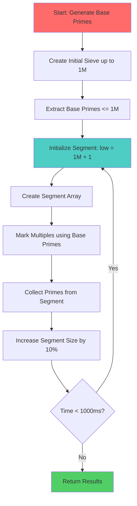

<div align="center">
  <a title="segmented-sieve">
    <picture>
      
    </picture>
  </a>
</div>

<div align="center">

  
  
  
  
</div>

<div align="center">
  <p>fast javascript implementation of the <strong>segmented sieve of eratosthenes</strong><br>Finds over <strong>7.6 million primes</strong> in just <strong>1 second</strong>⚡</p>
</div>

---

## performance benchmark

<p>segmented sieve implementation <b>dominates</b> other prime-finding algorithms:</p>
<div align="center">

| Algorithm              |  Primes Found |   Largest Prime | ⏱Time (sec) | Performance |
| :--------------------- | ------------: | --------------: | ----------: | :---------: |
| **🔥 Segmented Sieve** | **7,656,705** | **135,209,699** |   **1.091** |     🥇      |
| Simple Sieve           |       664,579 |       9,999,991 |       1.235 |     🥈      |
| Trial Division 6k±1    |       202,111 |       2,781,397 |       1.000 |     🥉      |
| Trial Division Basic   |       202,111 |       2,781,397 |       1.000 |     🏃‍♂️      |
| Wheel Sieve (2,3,5)    |       439,372 |       5,893,973 |       1.000 |     🚶‍♂️      |
| Naive Prime Check      |         8,107 |          83,003 |       1.000 |     🐌      |

</div>

> **(performance boost)** the _segmented sieve_ finds **11.5x more primes** than the _simple sieve_ and **945x more** than _naive_ approaches!

<details>
<summary>benchmark logs <b>▼</b></summary>

```
=== Benchmark start ===

Simple Sieve run 1: found 664,579 primes, time 1.192 sec, largest prime 9,999,991
Simple Sieve run 2: found 664,579 primes, time 1.162 sec, largest prime 9,999,991
Simple Sieve run 3: found 664,579 primes, time 1.196 sec, largest prime 9,999,991
Simple Sieve run 4: found 664,579 primes, time 1.179 sec, largest prime 9,999,991
Simple Sieve run 5: found 664,579 primes, time 1.160 sec, largest prime 9,999,991

Simple Sieve avg: found 664,579 primes, avg time 1.178 sec

Trial Division Basic run 1: found 181,297 primes, time 1.000 sec, largest prime 2,473,717
Trial Division Basic run 2: found 179,162 primes, time 1.000 sec, largest prime 2,442,497
Trial Division Basic run 3: found 180,527 primes, time 1.000 sec, largest prime 2,462,329
Trial Division Basic run 4: found 180,720 primes, time 1.000 sec, largest prime 2,465,011
Trial Division Basic run 5: found 180,681 primes, time 1.000 sec, largest prime 2,464,571

Trial Division Basic avg: found 180,477 primes, avg time 1.000 sec

Trial Division 6k±1 Optimization run 1: found 202,111 primes, time 1.000 sec, largest prime 2,781,397
Trial Division 6k±1 Optimization run 2: found 199,797 primes, time 1.000 sec, largest prime 2,747,021
Trial Division 6k±1 Optimization run 3: found 200,466 primes, time 1.000 sec, largest prime 2,757,049
Trial Division 6k±1 Optimization run 4: found 200,379 primes, time 1.000 sec, largest prime 2,755,829
Trial Division 6k±1 Optimization run 5: found 200,379 primes, time 1.000 sec, largest prime 2,755,829

Trial Division 6k±1 Optimization avg: found 200,626 primes, avg time 1.000 sec

Wheel Sieve 2,3,5 run 1: found 395,484 primes, time 1.000 sec, largest prime 5,274,649
Wheel Sieve 2,3,5 run 2: found 439,372 primes, time 1.000 sec, largest prime 5,893,973
Wheel Sieve 2,3,5 run 3: found 418,832 primes, time 1.000 sec, largest prime 5,603,737
Wheel Sieve 2,3,5 run 4: found 418,678 primes, time 1.000 sec, largest prime 5,601,593
Wheel Sieve 2,3,5 run 5: found 419,278 primes, time 1.000 sec, largest prime 5,610,277

Wheel Sieve 2,3,5 avg: found 418,329 primes, avg time 1.000 sec

Naive Prime Check run 1: found 8,107 primes, time 1.000 sec, largest prime 83,003
Naive Prime Check run 2: found 7,814 primes, time 1.000 sec, largest prime 79,801
Naive Prime Check run 3: found 7,821 primes, time 1.000 sec, largest prime 79,843
Naive Prime Check run 4: found 7,805 primes, time 1.000 sec, largest prime 79,669
Naive Prime Check run 5: found 7,820 primes, time 1.000 sec, largest prime 79,841

Naive Prime Check avg: found 7,873 primes, avg time 1.000 sec

Segmented Sieve run 1: found 7,656,705 primes, time 1.124 sec, largest prime 135,209,699
Segmented Sieve run 2: found 7,656,705 primes, time 1.111 sec, largest prime 135,209,699
Segmented Sieve run 3: found 7,656,705 primes, time 1.111 sec, largest prime 135,209,699
Segmented Sieve run 4: found 6,954,434 primes, time 1.010 sec, largest prime 122,099,717
Segmented Sieve run 5: found 7,656,705 primes, time 1.099 sec, largest prime 135,209,699

Segmented Sieve avg: found 7,516,251 primes, avg time 1.091 sec

=== Benchmark end ===
```

</details>

<details>
<summary>benchmark snip <b>▼</b></summary>

```javascript
async function benchmark(primeFinderFn, name, runs = 5, runDuration = 1000) {
  let totalCount = 0,
    totalTime = 0;
  for (let i = 0; i < runs; i++) {
    const { count, largest, time } = await primeFinderFn(runDuration);
    totalCount += count;
    totalTime += time;
    console.log(
      `${name} run ${
        i + 1
      }: found ${count.toLocaleString()} primes, time ${time.toFixed(
        3
      )} sec, largest prime ${largest.toLocaleString()}`
    );
  }
  const avgTime = totalTime / runs;
  console.log(
    `\n${name} avg: found ${Math.round(
      totalCount / runs
    ).toLocaleString()} primes, avg time ${avgTime.toFixed(3)} sec\n`
  );
  return { avgCount: Math.round(totalCount / runs), avgTime };
}

const simpleSieveBenchmark = (d) =>
  new Promise((res) => {
    const max = 1e7,
      t0 = performance.now();
    while (performance.now() - t0 < d) {
      const p = new Uint8Array(max + 1).fill(1);
      p[0] = p[1] = 0;
      for (let i = 2; i * i <= max; i++)
        if (p[i]) for (let j = i * i; j <= max; j += i) p[j] = 0;
    }
    const p = new Uint8Array(max + 1).fill(1);
    p[0] = p[1] = 0;
    for (let i = 2; i * i <= max; i++)
      if (p[i]) for (let j = i * i; j <= max; j += i) p[j] = 0;
    const count = p.reduce((a, v) => a + v, 0);
    for (var i = max; !p[i]; i--);
    res({ count, largest: i, time: (performance.now() - t0) / 1000 });
  });

const trialDivisionBasic = (d) =>
  new Promise((res) => {
    const t0 = performance.now(),
      primes = [];
    const isPrime = (n) =>
      n > 1 &&
      (n === 2 ||
        (n % 2 &&
          ![...Array(Math.floor(Math.sqrt(n) / 2)).keys()].some(
            (i) => n % (2 * i + 3) === 0
          )));
    for (let n = 2; performance.now() - t0 < d; n++)
      if (isPrime(n)) primes.push(n);
    res({
      count: primes.length,
      largest: primes.at(-1) || 0,
      time: (performance.now() - t0) / 1000,
    });
  });

const trialDivision6k1 = (d) =>
  new Promise((res) => {
    const t0 = performance.now(),
      primes = [];
    const isPrime = (n) => {
      if (n <= 3) return n > 1;
      if (n % 2 === 0 || n % 3 === 0) return false;
      for (let i = 5; i * i <= n; i += 6)
        if (n % i === 0 || n % (i + 2) === 0) return false;
      return true;
    };
    for (let n = 2; performance.now() - t0 < d; n++)
      if (isPrime(n)) primes.push(n);
    res({
      count: primes.length,
      largest: primes.at(-1) || 0,
      time: (performance.now() - t0) / 1000,
    });
  });

const wheelSieve235 = (d) =>
  new Promise((res) => {
    const wheel = [1, 7, 11, 13, 17, 19, 23, 29],
      size = 30,
      t0 = performance.now();
    const primes = [2, 3, 5];
    let count = 3,
      largest = 5,
      start = 7;
    const isPrimeBasic = (n) => primes.every((p) => p * p > n || n % p);
    while (performance.now() - t0 < d) {
      for (let b = 0; b < 100_000; b++) {
        const base = start + b * size;
        for (let w of wheel) {
          const num = base + w - 1;
          if (num >= 2 && isPrimeBasic(num))
            primes.push(num), count++, (largest = num);
          if (performance.now() - t0 >= d) break;
        }
        if (performance.now() - t0 >= d) break;
      }
      start += 100_000 * size;
    }
    res({ count, largest, time: (performance.now() - t0) / 1000 });
  });

const naivePrimeCheck = (d) =>
  new Promise((res) => {
    const t0 = performance.now(),
      primes = [];
    const isPrime = (n) =>
      n > 1 && ![...Array(n - 2).keys()].some((i) => n % (i + 2) === 0);
    for (let n = 2; performance.now() - t0 < d; n++)
      if (isPrime(n)) primes.push(n);
    res({
      count: primes.length,
      largest: primes.at(-1) || 0,
      time: (performance.now() - t0) / 1000,
    });
  });

const segmentedSieve = (d) =>
  new Promise((res) => {
    const t0 = performance.now(),
      max = 1e6;
    const isPrime = new Uint8Array(max + 1).fill(1);
    isPrime[0] = isPrime[1] = 0;
    for (let i = 2; i * i <= max; i++)
      if (isPrime[i]) for (let j = i * i; j <= max; j += i) isPrime[j] = 0;
    const basePrimes = [
      2,
      ...Array.from({ length: max / 2 }, (_, i) => 2 * i + 3).filter(
        (i) => isPrime[i]
      ),
    ];
    let found = [...basePrimes],
      low = max + 1,
      seg = 1e6;
    while (performance.now() - t0 < d) {
      const high = low + seg - 1,
        mark = new Uint8Array(seg).fill(1);
      for (let p of basePrimes) {
        const start = Math.max(p * p, Math.ceil(low / p) * p);
        for (let j = start; j <= high; j += p) mark[j - low] = 0;
      }
      for (let i = 0; i < seg; i++) if (mark[i]) found.push(low + i);
      low += seg;
      seg = Math.floor(seg * 1.1);
    }
    res({
      count: found.length,
      largest: found.at(-1),
      time: (performance.now() - t0) / 1000,
    });
  });

(async () => {
  console.log("=== Benchmark start ===\n");
  await benchmark(simpleSieveBenchmark, "Simple Sieve");
  await benchmark(trialDivisionBasic, "Trial Division Basic");
  await benchmark(trialDivision6k1, "Trial Division 6k±1 Optimization");
  await benchmark(wheelSieve235, "Wheel Sieve 2,3,5");
  await benchmark(naivePrimeCheck, "Naive Prime Check");
  await benchmark(segmentedSieve, "Segmented Sieve");
  console.log("\n=== Benchmark end ===");
})();
```

</details>

---

## ✨ Features

<div align="center">

```ascii
╔═════════════════════════════════════════════════════════════════════╗
║     memory efficient  │   lightning fast     │  smart segments      ║
╠═════════════════════════════════════════════════════════════════════╣
║     uses fixed-size   │   adaptive segment   │   dynamic growth     ║
║     memory blocks     │   size optimization  │   for better perf    ║
╚═════════════════════════════════════════════════════════════════════╝
```

</div>

- **adaptive segmentation**: dynamically increases segment size by 10% each iteration
- **memory optimized**: uses `Uint8Array` for efficient memory usage
- **performance focused**: optimized for speed with minimal overhead
- **large number support**: can handle numbers well beyond JavaScript's integer limits
- **real-time benchmarking**: built-in performance measurement

---

## quick start

### installation

```bash
git clone https://github.com/aitji/segmented-sieve.git
cd segmented-sieve
```

### basic usage

```javascript
const result = segmentedSieve();

console.log(`Found ${result.count.toLocaleString()} primes`);
console.log(`Largest prime: ${result.largest.toLocaleString()}`);
console.log(`Execution time: ${result.time.toFixed(3)}s`);
```

### expected output

```
Found 7,656,705 primes
Largest prime: 135,209,699
Execution time: 1.091s
```

---

## how it works

<div align="left">



</div>

the algorithm works in three phases:

### (phase 1): base prime generation

```javascript
// generate all primes up to 1 million using simple sieve
const primes = [2];
const max = 1e6; // 1,000,000
const isPrime = new Uint8Array(max + 1).fill(1);

/**
 * isPrime:
 * [0 … 9999]
 * [10000 … 19999]
 * [20000 … 29999]
 * ...
 * [990000 … 999999]
 */
```

### (phase 2): segmented sieving

```javascript
// process segments beyond 1 million
const nSegment = () => {
  const high = low + segSize - 1;
  const mark = new Uint8Array(segSize).fill(1);

  // mark multiples of each base prime
  for (let p of primes) {
    const start = Math.max(p * p, Math.ceil(low / p) * p);
    for (let j = start; j <= high; j += p) mark[j - low] = 0;
  }
};
```

### (phase 3): adaptive growth

```javascript
// dynamically increase segment size for better performance
segSize = Math.floor(segSize * 1.1);
```

---

## technical details

<details>
<summary>algorithm complexity <b>▼</b></summary>

- **time complexity**: `O(n log log n)` where `n` is the upper limit
- **space complexity**: `O(√n + segment_size)`
- **memory usage**: ~1MB for base primes + segment size `(starts at 1MB, grows to ~2.6MB)`

</details>

<details>
<summary>optimization techniques <b>▼</b></summary>

1. **uint8Array usage**: `8x` more memory efficient than regular arrays
2. **adaptive segmentation**: larger segments = fewer iterations = better cache performance
3. **smart starting points**: Only mark multiples starting from `max(p^2, ceil(low / p) * p)`
4. **odd-only processing**: skip even numbers `(except 2)` for 2x speedup

</details>

---

## benchmark results

<div align="center">

### performance comparison chart

```
Primes Found (in millions)
┌──────────────────────────────────────────────────────────────────┐
│ Segmented Sieve █████████████████████████████████████  7.66M     │
│ Simple Sieve    ███                                       0.66M  │
│ Wheel Sieve     ██                                        0.44M  │
│ Trial Div 6k±1  █                                         0.20M  │
│ Trial Div Basic █                                         0.20M  │
│ Naive Check     ▌                                         0.008M │
└──────────────────────────────────────────────────────────────────┘
          0M      2M      4M      6M      8M
```

</div>

### why segmented sieve (wins?)

| Advantage              | Description                                 |
| ---------------------- | ------------------------------------------- |
| **range extension**    | Can sieve numbers far beyond memory limits  |
| **memory efficiency**  | Fixed memory usage regardless of range      |
| **cache optimization** | Better cache locality with smaller segments |
| **scalability**        | Performance scales well with larger numbers |

---

## advanced usage

### integration example

```javascript
class primeGen {
  constructor() {
    this.segmentedSieve = segmentedSieve;
  }

  async genPrime(timeLimit = 1000) {
    return new Promise((resolve) => {
      setTimeout(() => resolve(this.segmentedSieve({ timeLimit })), 0);
    });
  }
}

// usaged
const gentor = new primeGen();
const primes = await gentor.genPrime(500); // 500ms
```

---

## 🤝 Contributing

im welcome contributions! here's how you can help

<div align="center">

```ascii
┌──────────────────────────────────────────────────────────────────────┐
│  🐛 Bug Reports  │  ✨ Features  │  📚 Documentation  │  🧪 Tests  │
└──────────────────────────────────────────────────────────────────────┘
```

</div>

1. **fork** the repository
2. **create** a feature branch (`git checkout -b feature/amazing-optimization`)
3. **commit** your changes (`git commit -m 'added amazing optimization'`)
4. **push** to the branch (`git push origin feature/amazing-optimization`)
5. **open** a pull request

---

## license

this project is licensed under the **MIT License** - see the [LICENSE](LICENSE) file for details.

---

<div align="center">

### 🌟 star this repo if you found it helpful :)

```ascii
⭐
⭐⭐⭐
⭐⭐⭐⭐⭐
⭐⭐⭐⭐⭐⭐⭐
⭐⭐⭐⭐⭐⭐⭐⭐⭐
```

  <a title="github visit counter" >
    <picture>
      
    </picture>
  </a>
</div>
